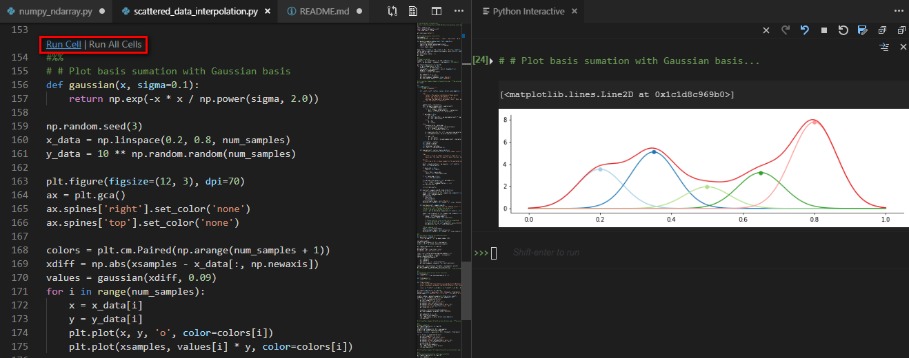

# Numex - Numerical Exercises

Numex is a playground to test and experiment numerical algorithms. With the help of numpy, matplotlib and jupyter, it is so much fun to play numerical algorithms in VS code.

# Environment Setup

1. Install [Visual Studio Code](https://code.visualstudio.com/) and [Python](https://marketplace.visualstudio.com/items?itemName=ms-python.python) extension.
2. Install [conda](https://conda.io/projects/conda/en/latest/user-guide/install/index.html#regular-installation), then create and activate a conda environment:
    ```
    conda create --name numex python=3.7
    conda install scipy matplotlib jupyter
    conda activate numex
    ```
3. Then open a script in exercises folder, just hit `Run Cell` or `Run All Cells` to play with:
